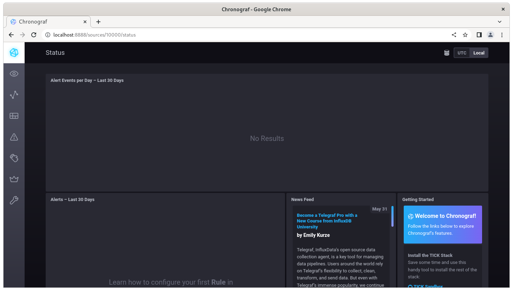
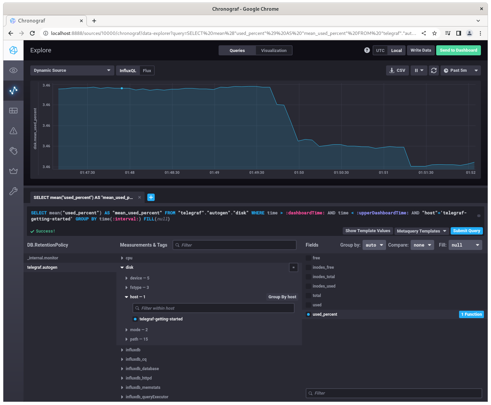
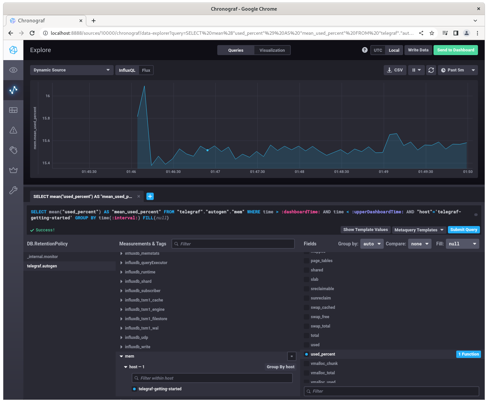
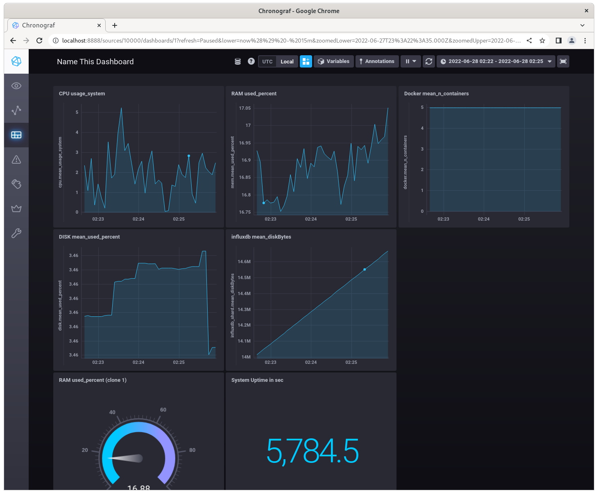

# Домашнее задание к занятию "10.02. Системы мониторинга"

## Обязательные задания

1. Опишите основные плюсы и минусы pull и push систем мониторинга.

- Плюсы Push-модели:
    - Упрощение репликации данных в разные системы мониторинга или их резервные копии;
    - Точка отправки или набор таких таких точек настраивается на стороне клиента;
    - Более гибкая настройка отправки пакетов данных с метриками (на каждом клиенте задается объем данных и частота отправки);
    - UDP является менее затратным способом передачи данных, вследствии чего может вырости производительность сбора метрик;
    - База данных занимается своей основной задачей – хранит метрики и управляет их жизненным циклом, пассивно ожидая записи новых данных.
- Минусы Push-модели:
    - Необходимость настройки на каждом хосте агента;
    - Потеря информации/метрик при недоступности агента;
    - Отсутсвие гарантии доставки при использовании UDP;
    - Сложности взаимодействия агентов через единый прокси, сложности со сбором логов с агентов.

- Плюсы Pull-модели:
    - Легче контролировать подлинность данных (гарантия опроса только тех агентов, которые настроены в системе мониторинга) 
    - Можно настроить единый proxy-server до всех агентов с TLS (таким образом мы можем разнести систему мониторинга и агенты, с гарантией безопасности их взаимодействия) 
    - Упрощенная отладка получения данных с агентов (так как данные запрашиваются посредством HTTP, можно самостоятельно запрашивать эти данные, используя ПО вне системы мониторинга)
    - Возможен мониторинг без агентов, например по SNMP, соответственно вообще не требуются настройки на объектах мониторинга
    - Единая точка конфигурирования, сам сервер мониторинга
    - Можно настроить единый proxy-server до всех агентов с TLS что позволяет разграничить систему мониторинга и агенты и обеспечить безопасность их взаимодействия;

- Минусы Pull-модели:
    - HTTP более затратный способ передачи в сравнении с UDP
    - Большая нагрузка на БД со стороны системы мониторинга, т.к. инициатором запросов метрик является система мониторинга 
    - Менее гибкая настройка отправки пакетов данных с метриками. При необходимости реализации индивидуальной частоты опроса придется создавать новый элемент данных и шаблон для каждого узла;
    - Единая точка отказа - сервер мониторинга.

2. Какие из ниже перечисленных систем относятся к push модели, а какие к pull? А может есть гибридные?

    - Prometheus  - pull, не смотря на то что можно настроить push gateway забирать метрики из него Prometheus будет как pull
    - TICK - push
    - Zabbix - гибридная
    - VictoriaMetrics - гибридная
    - Nagios - гибридная


3. Склонируйте себе [репозиторий](https://github.com/influxdata/sandbox/tree/master) и запустите TICK-стэк, 
используя технологии docker и docker-compose.

В виде решения на это упражнение приведите выводы команд с вашего компьютера (виртуальной машины):

    - curl http://localhost:8086/ping
    - curl http://localhost:8888
    - curl http://localhost:9092/kapacitor/v1/ping

<details>
     <summary>Результат выполнения команд:</summary>
    <br>


```bash
Use 'docker scan' to run Snyk tests against images to find vulnerabilities and learn how to fix them
[+] Running 5/5
 ⠿ Container sandbox-influxdb-1       Started                                                                                                                                                                                                                                        0.5s
 ⠿ Container sandbox-telegraf-1       Started                                                                                                                                                                                                                                        0.8s
 ⠿ Container sandbox-documentation-1  Started                                                                                                                                                                                                                                        0.5s
 ⠿ Container sandbox-kapacitor-1      Started                                                                                                                                                                                                                                        1.1s
 ⠿ Container sandbox-chronograf-1     Started                                                                                                                                                                                                                                        1.7s
Opening tabs in browser...
iva@c9v:~/Documents/10.02/sandbox  (master)$ Opening in existing browser session.
Opening in existing browser session.

iva@c9v:~/Documents/10.02/sandbox  (master)$ curl http://localhost:8086/ping -v
*   Trying ::1:8086...
* Connected to localhost (::1) port 8086 (#0)
> GET /ping HTTP/1.1
> Host: localhost:8086
> User-Agent: curl/7.76.1
> Accept: */*
> 
* Mark bundle as not supporting multiuse
< HTTP/1.1 204 No Content
< Content-Type: application/json
< Request-Id: 0bd06466-f66a-11ec-804f-0242ac120002
< X-Influxdb-Build: OSS
< X-Influxdb-Version: 1.8.10
< X-Request-Id: 0bd06466-f66a-11ec-804f-0242ac120002
< Date: Mon, 27 Jun 2022 22:39:46 GMT
< 
* Connection #0 to host localhost left intact
iva@c9v:~/Documents/10.02/sandbox  (master)$ curl http://localhost:9092/kapacitor/v1/ping -v
*   Trying ::1:9092...
* Connected to localhost (::1) port 9092 (#0)
> GET /kapacitor/v1/ping HTTP/1.1
> Host: localhost:9092
> User-Agent: curl/7.76.1
> Accept: */*
> 
* Mark bundle as not supporting multiuse
< HTTP/1.1 204 No Content
< Content-Type: application/json; charset=utf-8
< Request-Id: 1d8fc39d-f66a-11ec-8039-000000000000
< X-Kapacitor-Version: 1.6.4
< Date: Mon, 27 Jun 2022 22:40:16 GMT
< 
* Connection #0 to host localhost left intact
iva@c9v:~/Documents/10.02/sandbox  (master)$ curl http://localhost:8888
<!DOCTYPE html><html><head><meta http-equiv="Content-type" content="text/html; charset=utf-8"><title>Chronograf</title><link rel="icon shortcut" href="/favicon.fa749080.ico"><link rel="stylesheet" href="/src.9cea3e4e.css"></head><body> <div id="react-root" data-basepath=""></div> <script src="/src.a969287c.js"></script> </body></html>

iva@c9v:~/Documents/10.02/sandbox  (master)$ docker ps
CONTAINER ID   IMAGE                   COMMAND                  CREATED        STATUS         PORTS                                                                                                                             NAMES
ad987d718851   chrono_config           "/entrypoint.sh chro…"   10 hours ago   Up 4 minutes   0.0.0.0:8888->8888/tcp, :::8888->8888/tcp                                                                                         sandbox-chronograf-1
ab5a4a9efb5e   telegraf                "/entrypoint.sh tele…"   10 hours ago   Up 4 minutes   8092/udp, 8125/udp, 8094/tcp                                                                                                      sandbox-telegraf-1
b2348307c671   kapacitor               "/entrypoint.sh kapa…"   10 hours ago   Up 4 minutes   0.0.0.0:9092->9092/tcp, :::9092->9092/tcp                                                                                         sandbox-kapacitor-1
33e02fec997f   influxdb                "/entrypoint.sh infl…"   10 hours ago   Up 4 minutes   0.0.0.0:8082->8082/tcp, :::8082->8082/tcp, 0.0.0.0:8086->8086/tcp, :::8086->8086/tcp, 0.0.0.0:8089->8089/udp, :::8089->8089/udp   sandbox-influxdb-1
c45791fca7e0   sandbox_documentation   "/documentation/docu…"   10 hours ago   Up 4 minutes   0.0.0.0:3010->3000/tcp, :::3010->3000/tcp        
```

</details>


А также скриншот веб-интерфейса ПО chronograf (`http://localhost:8888`).



P.S.: если при запуске некоторые контейнеры будут падать с ошибкой - проставьте им режим `Z`, например
`./data:/var/lib:Z`

4. Перейдите в веб-интерфейс Chronograf (`http://localhost:8888`) и откройте вкладку `Data explorer`.

    - Нажмите на кнопку `Add a query`
    - Изучите вывод интерфейса и выберите БД `telegraf.autogen`
    - В `measurments` выберите mem->host->telegraf_container_id , а в `fields` выберите used_percent. 
    Внизу появится график утилизации оперативной памяти в контейнере telegraf.
    - Вверху вы можете увидеть запрос, аналогичный SQL-синтаксису. 
    Поэкспериментируйте с запросом, попробуйте изменить группировку и интервал наблюдений.

Для выполнения задания приведите скриншот с отображением метрик утилизации места на диске 
(disk->host->telegraf_container_id) из веб-интерфейса.

Для выполнения данного пункта предварительно в telegraf.conf добавил инпуты по диску и памяти, произвёл рестарт sandbox

```
[[inputs.mem]]
[[inputs.disk]]

```




5. Изучите список [telegraf inputs](https://github.com/influxdata/telegraf/tree/master/plugins/inputs). 
Добавьте в конфигурацию telegraf следующий плагин - [docker](https://github.com/influxdata/telegraf/tree/master/plugins/inputs/docker):
```
[[inputs.docker]]
  endpoint = "unix:///var/run/docker.sock"
```

* Данный инпут уже присутсвует в конфиге telegraf.conf

* Для того что бы появились метрики потребовалось внести изменнеия в docker-compose.yml указав 

```
iva@c9v:~/Documents/10.02/sandbox  (master *)$ export dockerGID=$(stat -c '%g' /var/run/docker.sock)
iva@c9v:~/Documents/10.02/sandbox  (master *)$ cat docker-compose.yml
...
  telegraf:
    # Full tag list: https://hub.docker.com/r/library/telegraf/tags/
    user: "telegraf:$dockerGID"
...

```


Дополнительно вам может потребоваться донастройка контейнера telegraf в `docker-compose.yml` дополнительного volume и 
режима privileged:
```
  telegraf:
    image: telegraf:1.4.0
    privileged: true
    volumes:
      - ./etc/telegraf.conf:/etc/telegraf/telegraf.conf:Z
      - /var/run/docker.sock:/var/run/docker.sock:Z
    links:
      - influxdb
    ports:
      - "8092:8092/udp"
      - "8094:8094"
      - "8125:8125/udp"
```

После настройке перезапустите telegraf, обновите веб интерфейс и приведите скриншотом список `measurments` в 
веб-интерфейсе базы telegraf.autogen . Там должны появиться метрики, связанные с docker.

Факультативно можете изучить какие метрики собирает telegraf после выполнения данного задания.

## Дополнительное задание (со звездочкой*) - необязательно к выполнению

В веб-интерфейсе откройте вкладку `Dashboards`. Попробуйте создать свой dashboard с отображением:

    - утилизации ЦПУ
    - количества использованного RAM
    - утилизации пространства на дисках
    - количество поднятых контейнеров
    - аптайм
    - ...
    - фантазируйте)
    
    ---



### Как оформить ДЗ?

Выполненное домашнее задание пришлите ссылкой на .md-файл в вашем репозитории.

---

