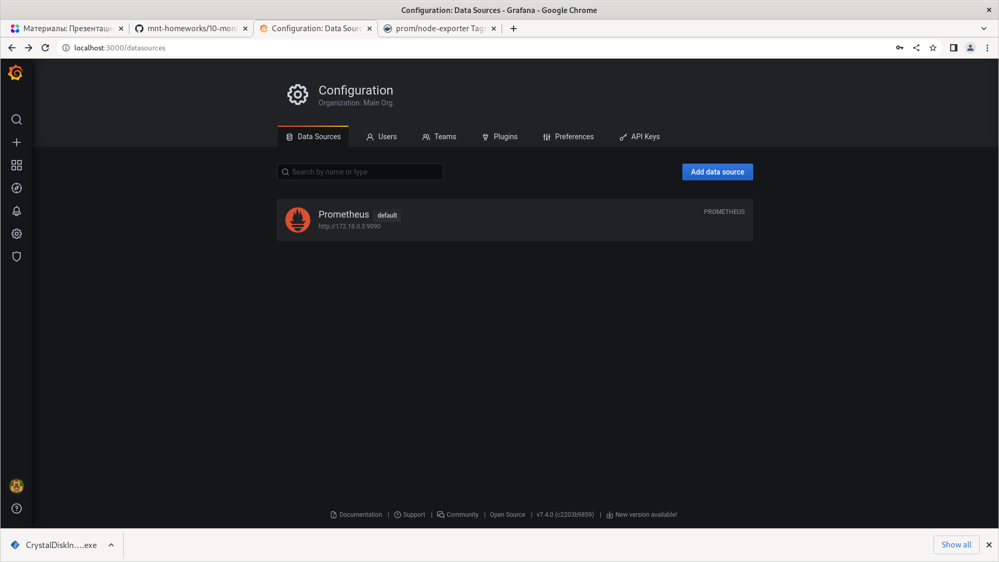
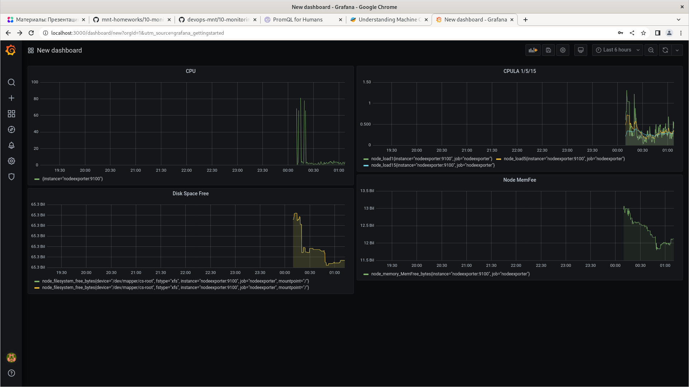
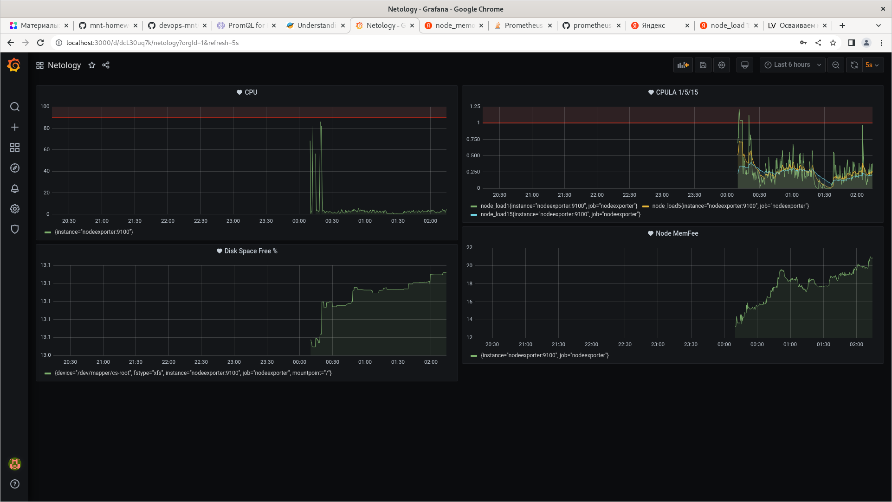

# Домашнее задание к занятию "10.03. Grafana"

## Задание повышенной сложности

**В части задания 1** не используйте директорию [help](./help) для сборки проекта, самостоятельно разверните grafana, где в 
роли источника данных будет выступать prometheus, а сборщиком данных node-exporter:
- grafana
- prometheus-server
- prometheus node-exporter

За дополнительными материалами, вы можете обратиться в официальную документацию grafana и prometheus.

В решении к домашнему заданию приведите также все конфигурации/скрипты/манифесты, которые вы 
использовали в процессе решения задания.

**В части задания 3** вы должны самостоятельно завести удобный для вас канал нотификации, например Telegram или Email
и отправить туда тестовые события.

В решении приведите скриншоты тестовых событий из каналов нотификаций.

## Обязательные задания

### Задание 1
Используя директорию [help](./help) внутри данного домашнего задания - запустите связку prometheus-grafana.

```bash
iva@c9v:~/Documents/10.03 $ docker ps
CONTAINER ID   IMAGE                       COMMAND                  CREATED         STATUS         PORTS                                       NAMES
d804c658566f   grafana/grafana:7.4.0       "/run.sh"                8 minutes ago   Up 8 minutes   0.0.0.0:3000->3000/tcp, :::3000->3000/tcp   grafana
9ec45047b0e5   prom/prometheus:v2.24.1     "/bin/prometheus --c…"   8 minutes ago   Up 8 minutes   9090/tcp                                    prometheus
a87d53a839a0   prom/node-exporter:v1.3.1   "/bin/node_exporter …"   8 minutes ago   Up 8 minutes   9100/tcp                                    nodeexporter
iva@c9v:~/Documents/10.03 $ docker container inspect 9ec45047b0e5 | grep IPAddress
            "SecondaryIPAddresses": null,
            "IPAddress": "",
                    "IPAddress": "172.18.0.3",
iva@c9v:~/Documents/10.03 $ 
```

Зайдите в веб-интерфейс графана, используя авторизационные данные, указанные в манифесте docker-compose.

- http://localhost:3000/login

Подключите поднятый вами prometheus как источник данных.

- Переходим в web-интерфейс Grafana, Configuration->Data sources, в строке поиска вводим prometeus и указываем адрес http://172.18.0.3:9090.

Решение домашнего задания - скриншот веб-интерфейса grafana со списком подключенных Datasource.



## Задание 2
Изучите самостоятельно ресурсы:
- [promql-for-humans](https://timber.io/blog/promql-for-humans/#cpu-usage-by-instance)
- [understanding prometheus cpu metrics](https://www.robustperception.io/understanding-machine-cpu-usage)

Создайте Dashboard и в ней создайте следующие Panels:
- Утилизация CPU для nodeexporter (в процентах, 100-idle)

    `100 - (avg by (instance) (rate(node_cpu_seconds_total{job="nodeexporter",mode="idle"}[1m])) * 100)`

- CPULA 1/5/15

    `node_load1{job="nodeexporter"}`
    `node_load5{job="nodeexporter"}`
    `node_load15{job="nodeexporter"}`

- Количество свободной оперативной памяти

    `node_memory_MemFree_bytes{job="nodeexporter"}`

- Количество места на файловой системе

    `node_filesystem_free_bytes{job="nodeexporter",mountpoint="/"}`

в дальнейшем изменено на % свободного места
    `100 - ((node_filesystem_avail_bytes{mountpoint="/",job="nodeexporter"} * 100) / node_filesystem_size_bytes{mountpoint="/",job="nodeexporter"})`


Для решения данного ДЗ приведите promql запросы для выдачи этих метрик, а также скриншот получившейся Dashboard.



## Задание 3
Создайте для каждой Dashboard подходящее правило alert (можно обратиться к первой лекции в блоке "Мониторинг").

Для решения ДЗ - приведите скриншот вашей итоговой Dashboard.



## Задание 4
Сохраните ваш Dashboard.

Для этого перейдите в настройки Dashboard, выберите в боковом меню "JSON MODEL".

Далее скопируйте отображаемое json-содержимое в отдельный файл и сохраните его.

В решении задания - приведите листинг этого файла.


---

### Как оформить ДЗ?

Выполненное домашнее задание пришлите ссылкой на .md-файл в вашем репозитории.

---
