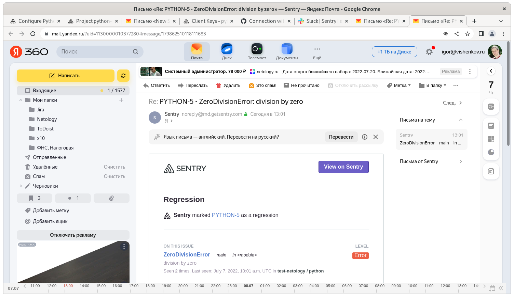

# Домашнее задание к занятию "10.05. Sentry"

## Задание 1

Так как self-hosted Sentry довольно требовательная к ресурсам система, мы будем использовать Free cloud аккаунт.

Free cloud account имеет следующие ограничения:
- 5 000 errors
- 10 000 transactions
- 1 GB attachments

Для подключения Free cloud account:
- зайдите на sentry.io
- нажжмите "Try for free"
- используйте авторизацию через ваш github-account
- далее следуйте инструкциям

Для выполнения задания - пришлите скриншот меню Projects.


## Задание 2

Создайте python проект и нажмите `Generate sample event` для генерации тестового события.

Изучите информацию, представленную в событии.

Перейдите в список событий проекта, выберите созданное вами и нажмите `Resolved`.

Для выполнения задание предоставьте скриншот `Stack trace` из этого события и список событий проекта, 
после нажатия `Resolved`.


## Задание 3

Перейдите в создание правил алёртинга.

Выберите проект и создайте дефолтное правило алёртинга, без настройки полей.

Снова сгенерируйте событие `Generate sample event`.

Если всё было выполнено правильно - через некоторое время, вам на почту, привязанную к github аккаунту придёт
оповещение о произошедшем событии.

Если сообщение не пришло - проверьте настройки аккаунта Sentry (например привязанную почту), что у вас не было 
`sample issue` до того как вы его сгенерировали и то, что правило алёртинга выставлено по дефолту (во всех полях all).
Также проверьте проект в котором вы создаёте событие, возможно алёрт привязан к другому.

Для выполнения задания - пришлите скриншот тела сообщения из оповещения на почте.

Дополнительно поэкспериментируйте с правилами алёртинга. 
Выбирайте разные условия отправки и создавайте sample events. 




## Задание повышенной сложности

Создайте проект на ЯП python или GO (небольшой, буквально 10-20 строк), подключите к нему sentry SDK и отправьте несколько тестовых событий.
Поэкспериментируйте с различными передаваемыми параметрами, но помните об ограничениях free учетной записи cloud Sentry.

Для выполнения задания пришлите скриншот меню issues вашего проекта и 
пример кода подключения sentry sdk/отсылки событий.


```python
#!/usr/bin/env python3
import logging
import random
import time
import sentry_sdk

import sentry_sdk
sentry_sdk.init(
    dsn="https://***************************1d318@o1308889.ingest.sentry.io/6554570",

    # Set traces_sample_rate to 1.0 to capture 100%
    # of transactions for performance monitoring.
    # We recommend adjusting this value in production.
    traces_sample_rate=1.0
)

#count = 0
#while True:
#  number = random.randrange(0, 10)
#  print(number)
#  if count == 5:
    #new_value=count/0
#  count += 1
#  time.sleep(1)

while True:
     try:
         x = int(input("Please enter a number: "))
         break
     except ValueError:
         print("Oops!  That was no valid number.  Try again...")

division_by_zero = 1 / 0

```

---

### Как оформить ДЗ?

Выполненное домашнее задание пришлите ссылкой на .md-файл в вашем репозитории.

---
